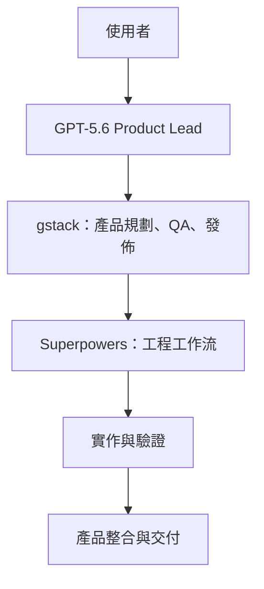
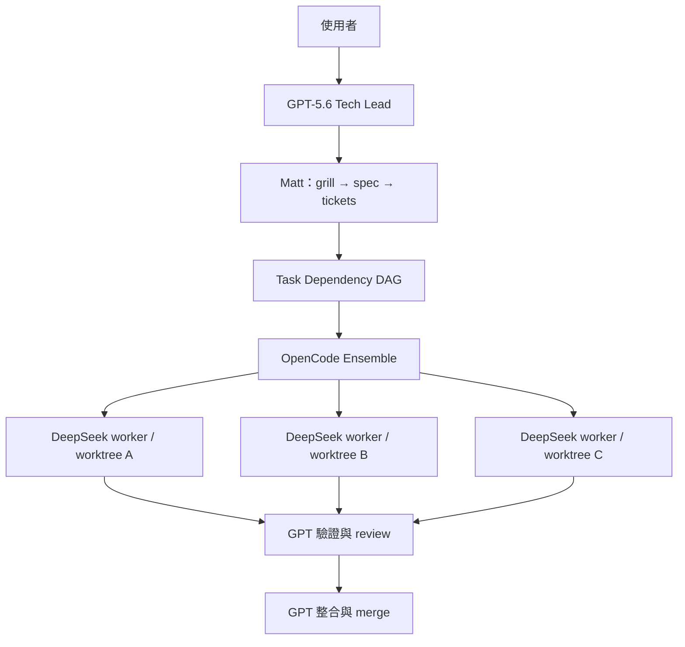

# OpenCode 雙工作流工具組

可攜、彼此隔離的 OpenCode 設定，提供兩種開發工作流。本 repository 只保存設定與還原腳本；憑證、OAuth 狀態、模型選擇、快取及第三方框架原始碼都留在本機。

## 工作流差異

| | PRODUCT | TEAM |
|---|---|---|
| 適用情境 | 快速產品交付、QA、發佈 | 高信心工程變更 |
| Lead | GPT-5.6 Sol | GPT-5.6 Sol |
| 方法論 | gstack + Superpowers | Matt Pocock skills |
| Worker | 依產品工作流選用 | DeepSeek V4.1 Flash (`OPENCODE_WORKER_MODEL`) |
| 測試 | 快速驗證 | 凍結的 acceptance-test contract |
| 平行化 | 有實際獨立工作時才使用 | Ensemble dependency DAG；預設 3、最多 4 個寫入 worker |
| 隔離 | PRODUCT workflow 內部管理 | 每張可寫 ticket 擁有自己的 Git worktree |

PRODUCT 不會進入 TEAM 方法論。TEAM 不載入 gstack 或 Superpowers；Matt skills 負責工程方法，OpenCode Ensemble 負責排程與 worktree 隔離。

## PRODUCT 執行架構



PRODUCT：用於快速產品迭代。GPT-5.6 主導產品判斷；gstack 與 Superpowers 提供產品、工程、QA 及發佈流程。只有確實獨立的寫入工作才建立 worktree 或平行執行。

## TEAM 執行架構



TEAM：每張 ticket 保持 **RED → GREEN → review** 因果順序。不同且獨立的 ticket 則由 Ensemble 非阻塞地同時啟動；相依工作會在前置條件完成後立即開始。Worker 僅能在自己的 worktree 建立一個有範圍限制的 transport commit，只有 GPT Lead 可以 merge。

## Windows 安裝

前置需求：Git、Node.js/npm、OpenCode、PowerShell，以及安裝 gstack 所需的 Git Bash 或 WSL。

```powershell
git clone https://github.com/<you>/opencode-dual-workflow-kit.git
Set-Location opencode-dual-workflow-kit
Set-ExecutionPolicy -Scope Process Bypass
./scripts/setup-windows.ps1 -InstallLaunchers
```

第一次 setup 會建立 `.local/models.ps1` 後停止。請在該電腦使用 OpenCode `/models` 查詢實際模型 ID，填入此檔案後再執行一次 setup。完成本機 provider 認證後執行：

```powershell
oc-product
oc-team
```

## macOS/Linux 安裝

```bash
git clone https://github.com/<you>/opencode-dual-workflow-kit.git
cd opencode-dual-workflow-kit
chmod +x scripts/*.sh
./scripts/setup-unix.sh --install-launchers
```

第一次執行後，填寫 `.local/models.sh` 的實際模型 ID，再執行一次 setup；然後使用 `oc-product` 或 `oc-team`。

## 安全性

絕不可 commit `.local/`、provider 憑證、OpenCode global config、OAuth 狀態、worktree 或 runtime database。詳見 [SECURITY.md](SECURITY.md)。

## 上游專案

- [OpenCode](https://opencode.ai/)
- [OpenCode Ensemble](https://github.com/hueyexe/opencode-ensemble)
- [Superpowers](https://github.com/obra/superpowers)
- [gstack](https://github.com/garrytan/gstack)
- [Matt Pocock Skills](https://github.com/mattpocock/skills)
