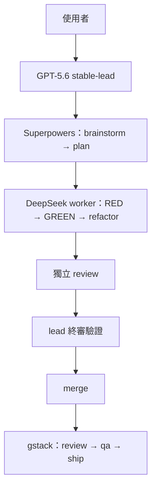
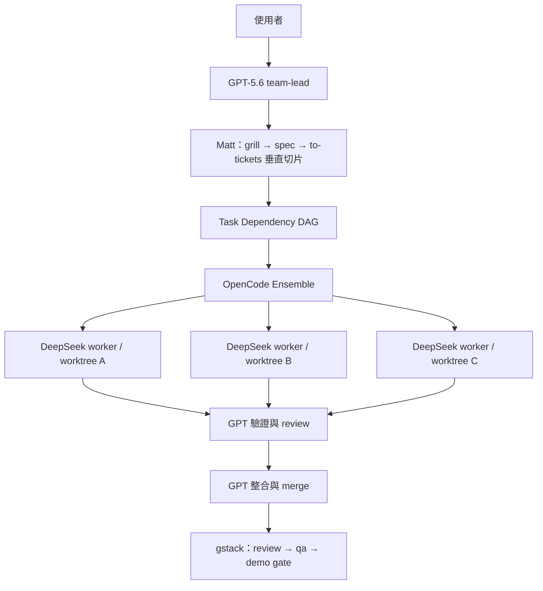

# OpenCode 雙工作流工具組

可攜、彼此隔離的 OpenCode 設定，提供兩種開發節奏。本 repository 只保存設定與還原腳本；憑證、OAuth 狀態、快取及第三方框架原始碼都留在本機。新電腦 clone 之後跑一次 setup 腳本，即可還原到與主力機相同的配置（剩下只需 `opencode auth login`）。

## 工作流差異

| | STABLE | TEAM |
|---|---|---|
| 入口 | `/stable <需求>` | `/team <需求>` |
| 適用情境 | 正式專案、Side Project、求職作品、auth／金流／安全、migration、複雜 bug | Hackathon、MVP、Demo、Prototype、限時開發 |
| Lead | GPT-5.6 `stable-lead` | GPT-5.6 `team-lead` |
| 方法論 | Superpowers（brainstorm→plan→TDD→review→驗證） | Matt Pocock skills（grill→spec→tickets→implement） |
| Worker | 每次一位 DeepSeek V4.1 Flash | 2–3 位 DeepSeek V4.1 Flash（完全獨立才 4 位） |
| 執行層 | 循序，不啟動 Ensemble | OpenCode Ensemble＋dependency DAG |
| 測試 | TDD，因果順序，lead 親見 GREEN 才 merge | 每張 ticket 凍結 acceptance-test contract，RED→GREEN→review |
| 隔離 | 需要時開 worktree | One ticket＝one branch＝one worktree |
| 核心取捨 | Reliability ＞ Speed | Speed＋Isolation ＞ 流程嚴格度 |

STABLE 不載入 Matt 方法論，TEAM 不載入 Superpowers，兩邊用 agent 權限實體隔離，不是口頭約定。gstack 是兩邊共用的專家工具箱（qa／review／ship／cso／investigate／plan-ceo-review／design-review／benchmark），只在驗證／整合後使用，命令加上 `gstack-` 前綴避免撞名。`retro` 兩邊都有同名 skill，刻意排除不包裝。

學到的教訓由 lead 在收尾時提煉，經使用者批准後寫入當專案的 AGENTS.md（兩次才入選、40 行預算、流水帳另存 `docs/learnings/`）。詳見設計原文 [`prompts/original-dual-workflow-brief.md`](prompts/original-dual-workflow-brief.md)。

## STABLE 執行架構



STABLE：同一時間只有一位 worker，循序開發。Worker 只拿最小上下文（任務、驗收標準、相關 plan、限制、檔案），reviewer 用全新上下文重審，不採信實作者的片面之詞。

## TEAM 執行架構



TEAM：每張 ticket 保持 **RED → GREEN → review** 因果順序。不同且獨立的 ticket 由 Ensemble 非阻塞地同時啟動，相依工作在前置條件完成後立即開始（dependency-driven，不是等整波結束）。Worker 最多重試 2 次，第 2 次需 lead 診斷，否則 lead 接手。Worker 不得改驗收測試、不得自己批准自己。

## PRODUCT 執行架構（相容保留）

`profiles/product`（Superpowers 快速產品流）與 `profiles/team`（TEAM V2 contract 流程）保留作相容層，用 `oc-product`／`oc-team` 啟動。新開發建議走全域 `/stable`／`/team`。

PRODUCT：用於快速產品迭代。GPT-5.6 主導產品判斷；gstack 與 Superpowers 提供產品、工程、QA 及發佈流程。只有確實獨立的寫入工作才建立 worktree 或平行執行。

## Windows 安裝

前置需求：Git、Node.js/npm、OpenCode、PowerShell，以及安裝 gstack 所需的 Git Bash 或 WSL。

```powershell
git clone https://github.com/hh123456tw/opencode-dual-workflow-kit.git
Set-Location opencode-dual-workflow-kit
Set-ExecutionPolicy -Scope Process Bypass
./scripts/setup-windows.ps1 -InstallLaunchers
```

setup 會依序：抓 Matt 精選 skills → 裝 gstack → 建 `.local/models.ps1`（已預填驗證過的模型 ID，第一次會停下來請你確認）→ 寫 ensemble.json → 部署全域 agents／commands → 補全域 config 與 gstack 路由（缺失才裝）→ 清掉 3 份以前的舊備份。完成本機 provider 認證後：

```powershell
oc-product
oc-team
```

或在任何專案直接用 `/stable`／`/team`。

## macOS/Linux 安裝

```bash
git clone https://github.com/hh123456tw/opencode-dual-workflow-kit.git
cd opencode-dual-workflow-kit
chmod +x scripts/*.sh
./scripts/setup-unix.sh --install-launchers
```

流程同 Windows，用 `oc-product` 或 `oc-team` 啟動。注意：unix 腳本尚未在 bash 環境實測過，回報問題請附 log。

## 還原檢查清單

完整步驟見 [`docs/restore-checklist.md`](docs/restore-checklist.md)。重點只有三件：跑 setup、登入 provider（`opencode auth login`）、確認 `opencode models` 看得到 GPT-5.6 與 DeepSeek。

## 安全性

絕不可 commit `.local/`、provider 憑證、OAuth 狀態、worktree 或 runtime database。詳見 [SECURITY.md](SECURITY.md)。

## 上游專案

- [OpenCode](https://opencode.ai/)
- [OpenCode Ensemble](https://github.com/hueyexe/opencode-ensemble)
- [Superpowers](https://github.com/obra/superpowers)
- [gstack](https://github.com/garrytan/gstack)
- [Matt Pocock Skills](https://github.com/mattpocock/skills)
