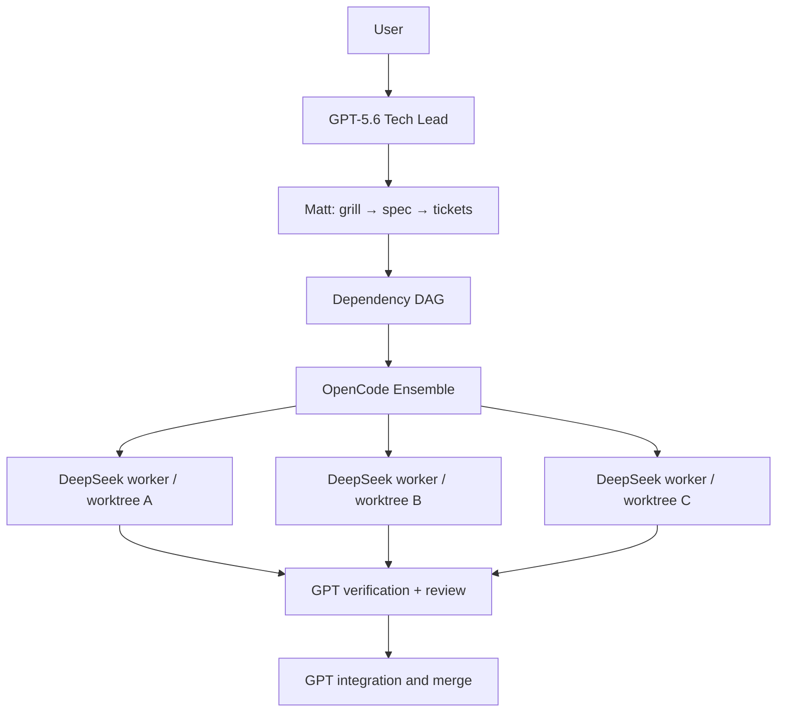

# OpenCode Dual Workflow Kit

Portable, isolated OpenCode profiles for two different kinds of development.
This repository contains configuration and restore scripts only: credentials,
OAuth state, model choices, caches, and third-party framework source stay local.

## Workflow differences

| | PRODUCT | TEAM |
|---|---|---|
| Best for | Fast product delivery, QA, and shipping | High-confidence engineering changes |
| Lead | GPT-5.6 Sol | GPT-5.6 Sol |
| Method | gstack + Superpowers | Matt Pocock skills |
| Worker | Product-selected worker flow | DeepSeek V4.1 Flash (`OPENCODE_WORKER_MODEL`) |
| Tests | Fast verification | Frozen acceptance-test contracts |
| Parallelism | Only when useful | Ensemble dependency DAG; default 3, max 4 writers |
| Isolation | Product workflow only | Dedicated Git worktree per writable ticket |

PRODUCT never routes into TEAM methodology. TEAM never loads gstack or
Superpowers; Matt skills define its engineering method while OpenCode Ensemble
does scheduling and worktree isolation.

## TEAM execution architecture



Within a ticket, causality remains **RED → GREEN → review**. Across independent
tickets, Ensemble starts every ready worker non-blockingly and starts dependent
work immediately when its prerequisites finish. A worker makes one scoped local
transport commit in its own worktree; only the GPT lead merges it.

## Install on Windows

Prerequisites: Git, Node.js/npm, OpenCode, PowerShell, and Git Bash or WSL for

```powershell
git clone https://github.com/<you>/opencode-dual-workflow-kit.git
Set-Location opencode-dual-workflow-kit
Set-ExecutionPolicy -Scope Process Bypass
./scripts/setup-windows.ps1 -InstallLaunchers
```

The first setup run creates `.local/models.ps1` and stops. Use OpenCode
`/models` on that computer, put its real model IDs in that file, then run setup
once more. Authenticate providers locally, then run:

```powershell
oc-product
oc-team
```

## Install on macOS/Linux

```bash
git clone https://github.com/<you>/opencode-dual-workflow-kit.git
cd opencode-dual-workflow-kit
chmod +x scripts/*.sh
./scripts/setup-unix.sh --install-launchers
cp scripts/models.sh.example .local/models.sh
```

Set actual local model IDs and provider authentication, then run `oc-product` or
`oc-team`.

## Security

Never commit `.local/`, provider credentials, OpenCode global config, OAuth
state, worktrees, or runtime databases. See [SECURITY.md](SECURITY.md).

## Upstream projects

- [OpenCode](https://opencode.ai/)
- [OpenCode Ensemble](https://github.com/hueyexe/opencode-ensemble)
- [Superpowers](https://github.com/obra/superpowers)
- [gstack](https://github.com/garrytan/gstack)
- [Matt Pocock Skills](https://github.com/mattpocock/skills)
