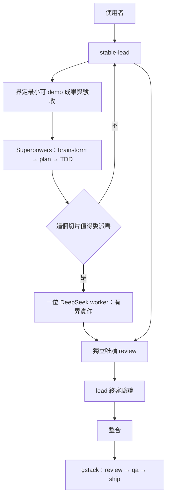

# OpenCode 單一工作流工具組

可攜的 OpenCode 設定，提供**一套**開發流程。本 repository 只保存設定與還原腳本；憑證、OAuth 狀態、快取及第三方框架原始碼都留在本機。新電腦 clone 之後跑一次 setup 腳本，即可還原到與主力機相同的配置（剩下只需 `opencode auth login`）。

## 為什麼只有一套

先前版本提供 STABLE 與 TEAM 兩套流程，TEAM 另外搭載 OpenCode Ensemble 多 agent 執行層。實測後移除，原因是結構性的，不是調參可以解決：

- Ensemble 每次呼叫都把 team state 注入 lead 的 system prompt。Prompt cache 依賴位元穩定的前綴，因此只要有任何 teammate 狀態變動，前綴就失效，lead 的 cache 幾乎完全吃不到。
- 每個 teammate 都是獨立 session，各自冷啟動。N 個 agent 等於 N 份無法共用的前綴，以及 N 次重讀同一個 repo。

結果就是更慢、更貴、更不穩。兩套流程同時也讓維護面加倍：兩份 lead 定義、兩套方法論、兩組 agent、兩個啟動入口、兩套測試，而日常工作其實只有一件事。

完整理由與設計見 [`docs/superpowers/specs/2026-09-18-single-workflow-design.md`](docs/superpowers/specs/2026-09-18-single-workflow-design.md)。

## 單一工作流



**一條規則，自動縮放。** 使用者不選模式；lead 讀取範圍與你提供的 deadline，自己決定要多重的流程。同一個時間只有一位寫入者。

| | 內容 |
|---|---|
| 入口 | `/stable <需求>`、Desktop profile `profiles/product`、CLI `oc-product` |
| Lead | `stable-lead`（模型由各入口的 config 決定） |
| 方法論 | Superpowers（brainstorm → plan → TDD → review → 驗證） |
| Worker | 需要時一位 DeepSeek V4.1 Flash，條件見下 |
| 執行層 | 循序；不使用任何多 agent orchestration |
| 核心取捨 | 每個成功切片的成本，不是每百萬 token 的價格 |

## 委派條件

Lead 預設自己做。只有四項全部成立才委派一位有界 worker：

1. 切片有明確且互斥的檔案所有權；
2. 不與其他進行中的工作共用 route、shared state、schema、套件／部署設定、可變 test fixture；
3. 有獨立的驗收檢查；
4. 可以獨立回滾。

任何一項不成立，lead 自己做完。委派不是為了製造平行度的錯覺。

## Deadline 自動分段

當你提供 deadline 或剩餘時間，lead 會套用對應階段；沒有提供時一律用 Build 紀律，並且會明說。

| 階段 | 剩餘時間 | 允許的工作 |
|---|---|---|
| Build | 6 小時以上 | 正常建立 spine 與高價值功能 |
| Feature Freeze | 2–6 小時 | 完成已接受的工作、整合、驗證；拒絕擴大範圍 |
| Demo Survival | 2 小時以下 | 只做 demo blocker、crash、壞掉的 UX、seed／mock fallback、展示路徑 |

Demo Survival 期間禁止 refactor、升級依賴、架構清理、schema migration，除非那正是 demo 路徑的直接阻塞。

## 進度以產物為準

不對任何 agent 設定「每 N 分鐘回報」的要求 —— agent 不會可靠計時，這種指令只會產生假進度。委派切片完成的唯一標準是 handback 內含：變更檔案、實際執行過的指令與結果、驗收結果、剩餘限制。沒有證據的 handback 一律退回，未完成的工作不會被當成完成，也不會進入主要路徑。

## Windows 安裝

前置需求：Git、Node.js/npm、OpenCode、PowerShell，以及安裝 gstack 所需的 Git Bash 或 WSL。

```powershell
git clone https://github.com/hh123456tw/opencode-dual-workflow-kit.git
Set-Location opencode-dual-workflow-kit
Set-ExecutionPolicy -Scope Process Bypass
./scripts/setup-windows.ps1 -InstallLaunchers
```

setup 會依序：裝 gstack → 建 `.local/models.ps1`（已預填驗證過的模型 ID，第一次會停下來請你確認）→ 部署全域 agents／commands（`stable-lead` 與 DeepSeek workers，以及 `/stable`、`/gstack-*` 指令）→ 補全域 config 與 gstack 路由（缺失才裝）→ 清掉 3 份以前的舊備份。若 `~/.config/opencode/opencode.jsonc` 已存在，setup 只會印出警告並保留原檔，不會改寫你的全域設定。完成本機 provider 認證後：

```powershell
oc-product
```

或在任何專案直接用 `/stable`。

## macOS/Linux 安裝

```bash
git clone https://github.com/hh123456tw/opencode-dual-workflow-kit.git
cd opencode-dual-workflow-kit
chmod +x scripts/*.sh
./scripts/setup-unix.sh --install-launchers
```

流程同 Windows，用 `oc-product` 啟動。注意：unix 腳本尚未在 bash 環境完整實測過，回報問題請附 log。

## 學習與還原

學到的教訓由 lead 在收尾時提煉，經使用者批准後寫入當專案的 AGENTS.md（兩次才入選、40 行預算、流水帳另存 `docs/learnings/`）。

還原步驟見 [`docs/restore-checklist.md`](docs/restore-checklist.md)。重點只有三件：跑 setup、登入 provider（`opencode auth login`）、確認 `opencode models` 看得到 GPT-5.6 與 DeepSeek。

## 安全性

絕不可 commit `.local/`、provider 憑證、OAuth 狀態、worktree 或 runtime database。詳見 [SECURITY.md](SECURITY.md)。

## 上游專案

- [OpenCode](https://opencode.ai/)
- [Superpowers](https://github.com/obra/superpowers)
- [gstack](https://github.com/garrytan/gstack)

設計原文：[`docs/superpowers/specs/2026-09-18-single-workflow-design.md`](docs/superpowers/specs/2026-09-18-single-workflow-design.md)
